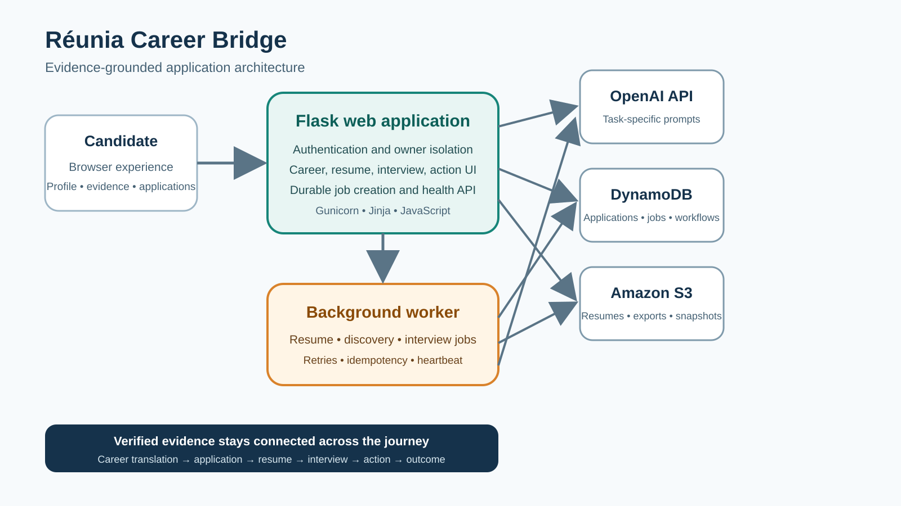

# Réunia Career Bridge

**Evidence-grounded AI for newcomers and internationally experienced professionals navigating the U.S. job market.**

Réunia Career Bridge helps candidates translate international experience into target-market language, preserve verified career evidence, discover relevant jobs, create job-specific application materials, prepare for interviews, practice with an adaptive mock interviewer, and turn feedback into a concrete action plan.

This repository is the submission codebase for the **Open Atlas — AI for Social Good Hackathon 2026**, primarily aligned with the **Career & Talent** and **Newcomer Settlement** tracks.

- **Live application:** [career.reunia.app](https://www.career.reunia.app/)
- **Hackathon:** [Open Atlas — AI for Social Good Hackathon 2026](https://oa-ai-for-social-good.devpost.com/)
- **Detailed technical documentation:** [`docs/`](docs/)
- **Submission kit:** [`docs/submission/`](docs/submission/)
- **License:** [Proprietary source-available](LICENSE)

> The repository root intentionally contains one Markdown documentation file: `README.md`. Detailed design, deployment, and validation documentation remains organized under `docs/`, `scripts/`, and `tests/`.

## The problem

Internationally experienced candidates can have strong skills and accomplishments while struggling to present them in the terminology, evidence format, and interview conventions expected by U.S. employers.

Many career tools optimize wording without preserving traceability, reuse unverified claims, or treat resume writing, job discovery, interview preparation, and follow-up as disconnected activities. This can make candidates choose between weak presentation and language that no longer reflects their actual experience.

Career Bridge addresses that gap by maintaining a reusable evidence foundation and carrying it through the complete job-search journey. Resume statements, interview guidance, and suggested actions are constrained by candidate-provided or candidate-confirmed evidence rather than invented experience.

## What the product does

1. **Career Profile** captures target roles, target market, languages, international background, credentials, and job-search preferences.
2. **Baseline Resume** imports or creates a reusable source resume.
3. **Career Evidence Library** stores candidate-confirmed facts that can be reused across applications.
4. **Job Discovery** collects supported public job postings, ranks them against verified experience and preferences, and lets the user create an application workspace.
5. **Job Applications** maintains one workspace per target role with status, dates, next steps, and application-specific artifacts.
6. **Resume Workflow** produces an Application Baseline, Job-Aligned Resume, improved draft, Final Resume, evidence review, and exports.
7. **Interview Preparation** creates role-specific preparation from the job, resume, application record, and verified evidence.
8. **Adaptive Mock Interview** supports recruiter, behavioral, hiring-manager, technical, final-round, and custom practice with adaptive follow-up questions.
9. **Interview Review** produces an evidence-grounded scorecard, answer-level feedback, and stronger example answers without adding unsupported claims.
10. **Career Action Plan** converts resume gaps, interview findings, upcoming interviews, follow-up dates, and application next steps into application-linked actions.
11. **Progress & Outcomes** tracks activity and outcomes across the candidate's job search.



The core journey is: **Career Profile → Baseline Resume → Career Evidence Library → Job Discovery → Application Workspace → Job-Aligned Resume → Interview Preparation → Adaptive Mock Interview → Interview Review → Career Action Plan → Progress & Outcomes**.

## Why the AI is substantive

The AI participates in a connected, evidence-aware workflow rather than serving as a single prompt behind a form:

- It analyzes job descriptions into explicit requirements.
- It compares requirements with verified resume evidence and distinguishes supported, unsupported, and missing evidence.
- It translates international titles, credentials, terminology, and accomplishments for a target market while preserving the underlying facts.
- It proposes job-aligned resume content under evidence constraints and supports multiple quality and grounding reviews.
- It generates role-specific interview preparation from the application record and evidence library.
- It conducts adaptive mock interviews and selects follow-up questions based on the candidate's previous response.
- It scores answers for relevance, evidence, STAR structure, clarity, alignment, confidence, and completeness.
- It generates application-specific next actions from gaps, dates, preparation needs, and interview findings.

Long-running Job Discovery assessments, Interview Preparation generation, and long Resume Workflow operations run as durable background jobs so they survive browser navigation, request timeouts, and web-container restarts.

## Evidence-grounding and human control

Career Bridge separates four concepts that career tools often mix together:

- **Candidate source material** — imported resumes and structured profile information.
- **Verified Resume Evidence** — facts supported by source material or explicitly confirmed by the candidate.
- **Generated wording** — target-market phrasing that can improve clarity but cannot change the underlying facts.
- **Application decisions** — job-specific choices about which verified evidence belongs in a tailored resume or interview response.

Safeguards include:

- no unsupported resume or interview claims;
- candidate confirmation before uncertain translations shape application wording;
- evidence provenance and review findings retained with the application;
- generated content presented for candidate review rather than treated as an established fact;
- no automatic employer submission or auto-apply behavior;
- contact details excluded from normal AI proposal-generation context;
- private application records isolated by owner;
- administrator-only AI configuration and catalog-management controls;
- no real sensitive personal data required for the hackathon demonstration.

The product does not provide immigration or legal advice and does not determine professional credential equivalency.

See [`docs/validation/no_invented_experience.md`](docs/validation/no_invented_experience.md) for the evidence-assurance boundary.

## Social impact

Career Bridge is designed for newcomers, immigrants, internationally trained professionals, career changers, and other candidates whose experience may be strong but difficult to translate into a new labor market.

The intended impact is to help candidates:

- communicate transferable experience without erasing its original context;
- build stronger applications without fabricating qualifications;
- reuse confirmed evidence instead of repeatedly answering the same questions;
- understand why a role matches or does not match their background;
- practice unfamiliar interview conventions in a structured environment;
- turn feedback into specific, time-bound next actions.

## Project history and Open Atlas disclosure

Réunia Career Bridge was developed during the Open Atlas submission period by bringing together two earlier codebases that were at very different stages of maturity.

- **Resume Tailor** was a rudimentary résumé-tailoring prototype that existed before the submission window opened on **June 20, 2026**. It provided early concepts for résumé import, job-description analysis, tailoring, comparison, evidence review, and export. This is the principal pre-hackathon product foundation disclosed by the submission.
- **Réunia** began as a separate AI meeting-assistant project **during the submission period**. Surviving development history places Réunia development underway no later than **June 22, 2026**. It later contributed useful application-shell, authentication, OpenAI, AWS, document, administrative, and operational patterns to Career Bridge. Because Réunia development began after the Open Atlas window opened, this repository does **not** classify the entire Réunia project as pre-hackathon work.
- **Réunia Career Bridge integration** began on **July 28, 2026**, when the two codebases started being brought together. The unified career journey and the majority of the Career Bridge-specific functionality in this repository were built or substantially expanded during the submission period.

The Git history published with this repository begins around the point when the two codebases were brought together. The published history preserves the original development chronology, commit messages, authorship, and commit dates. Historical content was sanitized only where necessary to remove personal or sensitive candidate data; it was not backdated or altered to manufacture development activity. The repository documents provenance explicitly so reviewers can distinguish the pre-hackathon Resume Tailor foundation, submission-period Réunia work, and the later Career Bridge integration.

For review:

- [`docs/submission/PREEXISTING_COMPONENTS.md`](docs/submission/PREEXISTING_COMPONENTS.md) — conservative component-by-component disclosure.
- [`docs/submission/HACKATHON_CHANGES.md`](docs/submission/HACKATHON_CHANGES.md) — functionality built or substantially expanded during the submission period.
- [`docs/submission/project-history/`](docs/submission/project-history/) — concise chronology and Git-history review guidance.

### Built or substantially expanded for Open Atlas

The hackathon-period work transformed the earlier foundations into the integrated Career Bridge product, including:

- the unified Career Bridge information architecture, navigation, visual system, and cross-feature data model;
- newcomer-focused Career Profile and target-market context;
- Baseline Resume and per-application Application Baseline behavior;
- Career Translation assessment for international terminology, titles, credentials, and experience;
- the reusable and editable Career Evidence Library, including confirmed-answer reuse across applications;
- Job Discovery source adapters, normalization, deduplication, freshness policies, filters, two-stage fit ranking, and conversion into application workspaces;
- job-specific application workspaces connecting status, dates, follow-ups, artifacts, and next steps;
- evidence-prioritized résumé bullet selection and safeguards against unsupported or zero-match bullets displacing stronger evidence;
- role-specific Interview Preparation;
- adaptive mock interview formats, saved custom questions, follow-up logic, persistence, and scorecards;
- Interview Review with answer-level findings and evidence-constrained improved responses;
- the application-linked Career Action Plan and Progress & Outcomes experience;
- durable DynamoDB and S3 storage for applications, workflows, documents, discovery records, and long-running AI jobs;
- the external background worker for Job Discovery assessment, Interview Preparation, and Resume Workflow processing;
- optimistic concurrency, owner isolation, cleanup behavior, cost controls, deployment gates, architecture checks, and expanded automated tests;
- product-wide UI consolidation, performance improvements, shared static assets, and removal of silent browser-storage persistence fallbacks.

## Try the demo

The live application is available at **https://career.reunia.app**. Use only fictional or synthetic information. The product does not provide immigration or legal advice and does not determine credential equivalency.

For judges or reviewers, the prepared journey uses **Thomas MARTIN**, a fictional French-market application-production professional targeting a U.S. **Senior Application Support Engineer** role:

1. Import the public-safe French resume and show **Responsable de Production Applicative** flagged for candidate clarification rather than automatically assigning an inflated U.S. title.
2. Save source-backed incident coordination, Oracle/Linux support, release-readiness, and service-continuity evidence to the **Career Evidence Library**.
3. Open the prepared fictional target application and show supported requirements alongside unverified gaps such as ServiceNow, observability platforms, cloud support, on-call rotation, and quantified service improvements.
4. Complete one short **Adaptive Mock Interview** answer and show the follow-up and evidence-grounded scorecard.
5. Finish with an application-linked action to collect a verified incident outcome or service metric rather than inventing one.

The complete three-minute narration and screenshot-capture command are in [`docs/submission/DEMO_PLAN.md`](docs/submission/DEMO_PLAN.md). The exact candidate setup, public-safe résumé, and fictional target job are under [`docs/submission/demo-data/`](docs/submission/demo-data/). The privacy boundary is in [`docs/submission/PRIVACY_AND_DEMO_DATA.md`](docs/submission/PRIVACY_AND_DEMO_DATA.md).

## Technology stack

| Layer | Technology |
|---|---|
| Web application | Python 3.11, Flask 3, Jinja, HTML, CSS, JavaScript |
| Production server | Gunicorn |
| AI | OpenAI API with task-specific model configuration and evidence-grounded prompts |
| Application and workflow data | Amazon DynamoDB |
| Documents and large snapshots | Amazon S3 / Lightsail Object Storage-compatible S3 access |
| Cache and production services | Redis where configured |
| Resume and document processing | `python-docx`, `pypdf`, ReportLab |
| Spreadsheet import/export | `openpyxl`, `xlrd` |
| Deployment | Docker, AWS Lightsail Container Service |
| Testing and validation | Python `unittest`, contract checks, integration checks, browser journeys, static-asset and architecture validators |

## Repository layout

```text
app.py                     Production WSGI entry point
career_bridge/             Shared domain, navigation, application, and storage abstractions
job_discovery/             Source adapters, normalization, ranking, scheduling, and discovery storage
products/resume_taylor/    Resume, translation, applications, discovery, and interview preparation
products/reunia/           Account shell, evidence, mock interview, review, actions, and analytics
config/quality/            Static-analysis and asset-budget configuration
scripts/                   Static builds, architecture checks, deployment, and validation utilities
tests/                     Unit, contract, integration, regression, and browser tests
docs/                      Product, design, deployment, and validation documentation
```

Resume Tailor templates have one canonical location: `products/resume_taylor/templates/application_builder/`. Parallel template copies should not be added at the template root.

### Canonical Job Application aggregate

`ApplicationRecord` is the single aggregate root for a job application. Application Materials, interview dates and preparation, contact or interview-audience notes, selected Knowledge documents, application-only uploads, Mock Interview context, outcomes, follow-up dates, and next actions must use the same application ID. The current product does not yet provide a recruiter-message history or communication-drafting workflow.

Application Materials are persisted in the canonical applications table as a linked `APPLICATION_MATERIALS#<application_id>` record. Adaptive Mock Interview sessions use owner-scoped `MOCK_INTERVIEW_SESSION#<session_id>` records in that same table and link back to the application ID when one is selected. Large JSON and document bytes remain in private object storage. The former meeting-workspace model and its migration runtime have been removed; job applications are now the only supported aggregate.

## Getting started

### Prerequisites

- Python 3.11
- An OpenAI API key
- AWS credentials with access to the required DynamoDB tables
- An S3 bucket for durable document storage in production
- Redis for production deployments that enable Redis-backed services
- Docker for containerized execution

### 1. Clone and install

Clone the repository from its GitHub **Code** menu, open a terminal in the cloned `reunia-career-bridge` directory, and run:

```bash
python -m venv .venv
```

Activate the environment:

```bash
# macOS or Linux
source .venv/bin/activate

# Windows PowerShell
.venv\Scripts\Activate.ps1
```

Install runtime dependencies to run the application:

```bash
python -m pip install --upgrade pip
python -m pip install -r requirements.txt
```

For development, the complete test suite, and Playwright browser validation, install the separate development requirements and the managed Chromium browser:

```bash
python -m pip install -r requirements-dev.txt
python -m playwright install chromium
```

On Linux CI runners, install Chromium and its operating-system dependencies with:

```bash
python -m playwright install --with-deps chromium
```

### 2. Configure development

Create a `.env` file. The following example boots only the canonical Career Bridge journey and uses DynamoDB for application and background-job records:

```dotenv
APP_ENV=development
FLASK_SECRET_KEY=replace-with-a-development-secret
OPENAI_API_KEY=replace-with-your-openai-key
AWS_REGION=us-west-2

# Shared account shell
USERS_TABLE_NAME=careerbridge_users
TRANSCRIPTS_TABLE_NAME=careerbridge_transcripts
TRANSCRIPTS_USER_INDEX=user_id-index

# Core Career Bridge services
ACTIONS_STORAGE_BACKEND=memory
ANALYTICS_STORAGE_BACKEND=memory
SUPPORT_STORAGE_BACKEND=memory
KNOWLEDGE_STORAGE_BACKEND=local
KNOWLEDGE_FILE_STORAGE_BACKEND=local
RATE_LIMIT_STORAGE_BACKEND=memory
ADMIN_ANALYTICS_CACHE_BACKEND=memory


# Career Bridge
CAREER_BRIDGE_APPLICATION_STORAGE_BACKEND=dynamodb
CAREER_BRIDGE_APPLICATIONS_TABLE_NAME=careerbridge_applications

CAREER_BRIDGE_WORKFLOW_STORAGE_BACKEND=memory
CAREER_BRIDGE_DOCUMENT_STORAGE_BACKEND=local
CAREER_BRIDGE_DOCUMENTS_LOCAL_PATH=instance/career_bridge_documents

CAREER_BRIDGE_JOB_DISCOVERY_STORAGE_BACKEND=dynamodb
CAREER_BRIDGE_JOB_DISCOVERY_TABLE_NAME=careerbridge_job_discovery

CAREER_BRIDGE_ASYNC_JOB_STORAGE_BACKEND=dynamodb
CAREER_BRIDGE_ASYNC_JOBS_TABLE_NAME=careerbridge_job_discovery
```

All Career Bridge DynamoDB table names must use the canonical `careerbridge_` prefix. The legacy `career-bridge-` prefix is rejected because provisioning it would create separate duplicate tables instead of reusing the existing data.

The Career Bridge application, workflow, and Job Discovery tables use this key structure unless the deployment documentation specifies otherwise:

```text
Partition key: owner_id    (String)
Sort key:      storage_key (String)
```

The shared account shell additionally expects the users table. The transcripts table stores Adaptive Mock Interview reviews; the retired generic `/api/transcripts` meeting API is not registered by default. See [`docs/deployment/lightsail.md`](docs/deployment/lightsail.md) for the complete table and permissions contract.

### 3. Build and validate static assets

```bash
python scripts/build_static_assets.py
```

Verify committed generated assets without modifying them:

```bash
python scripts/build_static_assets.py --check
```

The CSS system uses one canonical `--cb-*` custom-property namespace. Raw hex colors are permitted only in `products/reunia/static/css/design-tokens.css`; page and component styles must consume semantic or centralized exact-value tokens. Validate the migration policy and Stylelint rules with:

```bash
python scripts/check_css_token_policy.py
npm install --no-audit --no-fund
npm run lint:css
```

`declaration-no-important` is reported as a Stylelint warning. The Python policy also prevents the reviewed `!important` baseline or exact-value palette from increasing.

### 4. Run the web application

```bash
python app.py
```

Open `http://localhost:8000` and sign in with a development account.

### 5. Run the background worker

Long-running Job Discovery assessments, Interview Preparation jobs, and Resume Workflow jobs require a separate worker:

```bash
python -m job_discovery.background_worker --poll --interval 5
```

The worker writes a durable heartbeat into the async-job DynamoDB table every 15 seconds, including while a long AI call is running. `/health` exposes the heartbeat age and worker state. The live deployment validator fails when the heartbeat is missing, stale, stopping, or unavailable, preventing a release that can accept jobs without processing them.

Without this process, the web application can accept durable jobs, but they remain queued. Resume Workflow jobs include Baseline Resume translation, job analysis and initial tailoring, report regeneration, final optimization/evidence review, and final Word/PDF generation.

## Docker

Build and run the public web container:

```bash
docker build -t reunia-career-bridge .
docker run --rm -p 8000:8000 --env-file .env reunia-career-bridge
```

Run the worker from the same image and environment in a second private container:

```bash
docker run --rm --env-file .env \
  reunia-career-bridge \
  python -m job_discovery.background_worker --poll --interval 5
```

The public container exposes port `8000`. The worker should not expose a public endpoint.

## Production configuration

The normal production baseline uses DynamoDB and S3 for durable Career Bridge storage:

```dotenv
APP_ENV=production
FLASK_SECRET_KEY=<strong-secret>
OPENAI_API_KEY=<openai-key>
AWS_REGION=us-west-2

CAREER_BRIDGE_APPLICATION_STORAGE_BACKEND=dynamodb
CAREER_BRIDGE_APPLICATIONS_TABLE_NAME=careerbridge_applications

CAREER_BRIDGE_WORKFLOW_STORAGE_BACKEND=dynamodb
CAREER_BRIDGE_WORKFLOWS_TABLE_NAME=careerbridge_workflows

CAREER_BRIDGE_JOB_DISCOVERY_STORAGE_BACKEND=dynamodb
CAREER_BRIDGE_JOB_DISCOVERY_TABLE_NAME=careerbridge_job_discovery

CAREER_BRIDGE_ASYNC_JOB_STORAGE_BACKEND=dynamodb
CAREER_BRIDGE_ASYNC_JOBS_TABLE_NAME=careerbridge_job_discovery
CAREER_BRIDGE_ASYNC_JOB_LEASE_SECONDS=900
CAREER_BRIDGE_ASYNC_WORKER_HEARTBEAT_INTERVAL_SECONDS=15
CAREER_BRIDGE_ASYNC_WORKER_MAX_AGE_SECONDS=90
CAREER_BRIDGE_ASYNC_WORKER_HEALTH_CACHE_SECONDS=10
CAREER_BRIDGE_RESUME_ASYNC_AI_TIMEOUT_SECONDS=240

CAREER_BRIDGE_DOCUMENT_STORAGE_BACKEND=s3
CAREER_BRIDGE_DOCUMENTS_BUCKET=<private-bucket-name>
CAREER_BRIDGE_DOCUMENTS_PREFIX=career-bridge

CAREER_BRIDGE_ALLOW_DEMO_STORAGE_IN_PRODUCTION=false

```

The core deployment still requires authentication, Career Action Plan, analytics, support, Career Evidence, and document-storage configuration. Redis is optional: configure `REDIS_URL` only when `RATE_LIMIT_STORAGE_BACKEND=redis` or `ADMIN_ANALYTICS_CACHE_BACKEND=redis`. Recorder queues, recorder buckets, public meeting shares, and their deployment variables have been removed.

Production startup rejects unsafe or incomplete Career Bridge storage configuration. The legacy-named `CAREER_BRIDGE_ALLOW_DEMO_STORAGE_IN_PRODUCTION` override is for controlled validation only and should remain `false` for a normal deployment.

See [`docs/deployment/lightsail.md`](docs/deployment/lightsail.md) for Lightsail configuration, DynamoDB schemas, S3 permissions, health checks, and release validation.

## Retired meeting runtime

The predecessor long-form meeting recorder, recorder worker and queue, public meeting-sharing links, generic meeting transcript aliases, meeting-knowledge aliases, Live Q&A, and meeting-material migration code have been removed. Do not configure `RECORDER_JOBS_BUCKET`, `MEETING_SHARES_TABLE_NAME`, or any `CAREER_BRIDGE_ENABLE_LEGACY_*` variables. Adaptive Mock Interview, Interview Review, Career Evidence Library, Career Profile, and Application Materials continue through canonical Career Bridge routes.

## Job Discovery safeguards

Job Discovery collects publicly accessible postings from supported applicant-tracking systems and Schema.org job pages. It applies domain restrictions, public-address checks, robots and source-policy checks, bounded requests, normalization, deduplication, and posting-age rules.

The shared catalog is managed by administrators or configured catalog managers. Users retain private search preferences, saved and ignored jobs, fit snapshots, and application workspaces.

Job Discovery never applies to an employer automatically. A user must explicitly create an internal application workspace.

See [`docs/job_discovery.md`](docs/job_discovery.md).

## Storage and durability

Application metadata is stored in DynamoDB. Uploaded resumes, generated DOCX and PDF files, large workflow snapshots, resume findings, interview-preparation snapshots, and progress details are stored in object storage.

Application-linked workflows are retained until explicit deletion. Temporary workflows may use a time-to-live policy.

Long-running Job Discovery assessment, Interview Preparation generation, and long Resume Workflow operations are accepted as durable jobs and executed by a separate worker rather than inside a Flask or Gunicorn request. Queue records, progress, failure information, cancellation requests, and terminal results remain in DynamoDB.

## Tests and validation

Run all discoverable tests:

```bash
python -m unittest discover -s tests -t . -v
```

Run dependency-aware final checks:

```bash
python tests/run_final_integration_checks.py \
  --json-output reports/validation/final-integration-check-results.json
```

Require runtime and browser dependencies in CI or release validation. This command fails when a runtime package or Playwright-managed Chromium is missing, so a blocked browser phase cannot be reported as a successful build:

```bash
python tests/run_final_integration_checks.py \
  --require-runtime \
  --json-output reports/validation/final-integration-check-results.json
```

GitHub Actions runs this command from `.github/workflows/runtime-tests.yml` after installing `requirements-dev.txt` and Playwright Chromium.

Run the repository-side submission gate:

```bash
python scripts/submission/check_submission_readiness.py --full
```

After publishing the repository, recording the demo video, capturing at least three real browser screenshots, and deploying the final build, run the strict gate with `OPEN_ATLAS_REPOSITORY_URL` and `OPEN_ATLAS_DEMO_VIDEO_URL` set:

```bash
python scripts/submission/check_submission_readiness.py --strict --full
```

The browser runtime phase also validates CSP compatibility: key pages must load under the nonce-based script policy, Job Discovery filters must auto-submit without inline handlers, and destructive source removal must show a working confirmation dialog.

Run principal static and architectural checks directly:

```bash
python scripts/build_static_assets.py --quiet
python scripts/check_asset_budgets.py
python scripts/check_application_builder_route_architecture.py
python scripts/check_async_ai_architecture.py
python scripts/check_browser_storage_policy.py
python scripts/check_common_page_assets.py
python scripts/check_css_token_policy.py
npm run lint:css
```

See [`tests/README.md`](tests/README.md) for test groups and [`docs/validation/validation_report.md`](docs/validation/validation_report.md) for the quality-contract overview.

## Cleaning up a Career Bridge test user

The maintenance utility defaults to a read-only preview and checks the current
Career Bridge DynamoDB tables for an exact user ID or email:

```bat
scripts\delete_dynamodb_user_records.bat test-user@example.com
```

After reviewing every table and key, enable destructive mode:

```bat
scripts\delete_dynamodb_user_records.bat test-user@example.com --delete
```

The script reads `.env` when present, honors the configured table names and AWS
Region, uses the canonical `careerbridge_` defaults, and skips tables that do not
exist. `--delete --yes` is available for controlled unattended cleanup. Add
`--discover-tables` to inspect every existing table with the `careerbridge_`
prefix when the AWS identity has `dynamodb:ListTables`.

The utility also derives the hashed Workflow IDs used by Career Foundation and
application workflows, so a deleted user's Baseline Resume cannot reappear when
the same email registers again. When `CAREER_BRIDGE_DOCUMENTS_BUCKET` is set (or
`--bucket <name>` is supplied), destructive mode removes the user's Career Bridge
S3 objects under the configured document prefix. Use `--keep-s3` only when those
objects must intentionally be retained. Support attachments and objects in other
buckets are outside this script's scope.

## Limitations and next steps

- Employer sites may block direct access or require authorized feeds.
- AI output remains a proposal until reviewed by the candidate.
- The system does not provide immigration or legal advice.
- The system does not determine professional credential equivalency.
- The system does not submit job applications or impersonate the candidate.
- Production readiness depends on deployment-specific secrets, AWS resources, worker availability, monitoring, and strict integration validation.

### Current application follow-up support

The current release supports upcoming interview dates, application follow-up dates, custom next steps, interview-preparation actions, and post-interview thank-you actions. It does not currently provide recruiter-message history, a communication-drafting workflow, calendar synchronization, a cover-letter workflow, or advanced application analytics.

### Secondary-feature roadmap

These features are intentionally secondary to the core application, resume, interview, and Career Action Plan workflows:

1. Communication log attached to an application.
2. Thank-you and follow-up message templates.
3. Recruiter-response drafting.
4. Optional calendar synchronization.
5. Cover-letter generation.
6. Advanced application analytics.

Other potential future work includes broader authorized job-source integrations, additional accessibility testing, and stronger multilingual evaluation.

## Maintainable module composition

The largest Career Bridge modules are implemented as small composition facades backed by cohesive components:

- Job Discovery controllers are separated into workspace/read-model, source-management, operation/orchestration, and result-action modules under `application_builder_routes/job_discovery_routes/`.
- Resume Workflow controllers are separated into workspace, configuration, profile, tailoring, confirmation, finalization, download, and background-job modules under `application_builder_routes/resume_workflow_routes/`.
- Resume Report matching, evidence, content, document inspection, formatting, and report assembly are split into `resume_report_*` modules.
- Admin Analytics and Mock Interview use focused service mixins rather than multi-thousand-line service classes.
- Job Discovery persistence is separated into base contracts, in-memory, JSON, DynamoDB, and serialization modules.

The route registrars contain no nested route handlers. Repository contracts enforce facade and component size budgets so new behavior is added to the module that owns it instead of rebuilding monolithic files.

## Documentation

- [`docs/job_discovery.md`](docs/job_discovery.md) — source adapters, ranking, scheduling, safeguards, and storage.
- [`docs/deployment/lightsail.md`](docs/deployment/lightsail.md) — Lightsail deployment, durable storage, health checks, table schemas, and production validation.
- [`docs/design/color-system.md`](docs/design/color-system.md) — shared product color and UI-token guidance.
- [`docs/job_aligned_bullet_selection.md`](docs/job_aligned_bullet_selection.md) — evidence-prioritized resume bullet selection.
- [`docs/validation/final_integration_checks.md`](docs/validation/final_integration_checks.md) — final quality-check runner.
- [`docs/validation/no_invented_experience.md`](docs/validation/no_invented_experience.md) — evidence-grounding controls.
- [`docs/validation/production_storage_migration_check.md`](docs/validation/production_storage_migration_check.md) — production persistence contract.
- [`docs/validation/validation_report.md`](docs/validation/validation_report.md) — current validation overview.
- [`docs/submission/HACKATHON_CHANGES.md`](docs/submission/HACKATHON_CHANGES.md) — work added or substantially changed for the hackathon submission.
- [`docs/submission/PREEXISTING_COMPONENTS.md`](docs/submission/PREEXISTING_COMPONENTS.md) — pre-existing foundations retained in the submission.
- [`docs/submission/DEMO_PLAN.md`](docs/submission/DEMO_PLAN.md) — three-minute demo narration and real screenshot capture workflow.
- [`docs/submission/demo-data/`](docs/submission/demo-data/) — Thomas MARTIN synthetic résumé, target job, and account setup.
- [`docs/submission/DEVPOST_SUBMISSION_COPY.md`](docs/submission/DEVPOST_SUBMISSION_COPY.md) — ready-to-paste project description and disclosures.
- [`docs/submission/PRIVACY_AND_DEMO_DATA.md`](docs/submission/PRIVACY_AND_DEMO_DATA.md) — synthetic-data and media privacy rules.
- [`docs/submission/SUBMISSION_CHECKLIST.md`](docs/submission/SUBMISSION_CHECKLIST.md) — repository, deployment, media, and Devpost release gates.
- [`docs/submission/pitch-deck.pdf`](docs/submission/pitch-deck.pdf) — concise four-page judge-facing pitch deck.

Generated files under `reports/validation/` are local or CI execution output, are ignored by Git, and are not bundled with the source package.

## License

Career Bridge is proprietary commercial software. The source is publicly viewable for hackathon evaluation and private technical review under the [Proprietary Source-Available License](LICENSE). It is not open source, and no permission is granted for commercial use, redistribution, public deployment, or derivative products without prior written authorization.

## Contributions

This repository is published for hackathon evaluation rather than as an open-source collaboration project. Please do not submit unsolicited pull requests. Any invited contribution must be covered by a separate written contributor or intellectual-property agreement.

Internal contributors should:

1. Create a focused branch.
2. Keep feature routes inside the module that owns them.
3. Reuse shared CSS, JavaScript, design tokens, and storage abstractions rather than adding page-specific copies.
4. Add or update tests for user-visible and persistence behavior.
5. Run the full test and validation commands before opening a pull request.
6. Never commit secrets, production resumes, recordings, transcripts, or other sensitive personal data.
