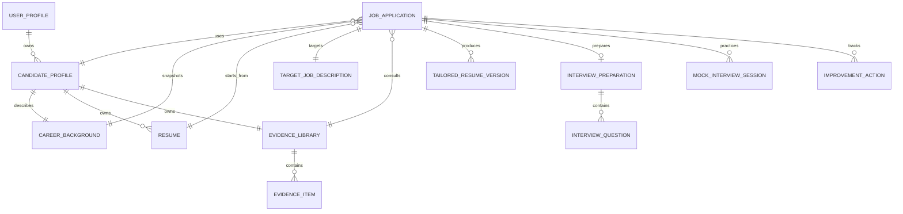

# Shared Career Bridge Domain Model

## Aggregate root

`JobApplication` is the central Career Bridge object. It represents one candidate pursuing one target job. It is not a renamed meeting and it is not a container for legacy route state.

The aggregate root stores stable shared IDs and lifecycle state. Existing Réunia and Resume Taylor records can remain in their original stores and be linked through adapters.



## Required application relationships

A new `JobApplication` requires references to:

- `CandidateProfile` — the candidate-facing identity used in career workflows;
- `CareerBackground` — normalized work history, education, skills, and certifications;
- `Resume` — the selected reusable source resume;
- `TargetJobDescription` — the role and company being pursued;
- `EvidenceLibrary` — verified or candidate-confirmed facts available to tailoring and interview preparation.

The following relationships are added as the workflow advances:

- one or more `TailoredResumeVersion` records, with one optional current version;
- one `InterviewPreparation` record and its interview questions;
- zero or more `MockInterviewSession` records;
- zero or more `ImprovementAction` records;
- application-scoped scores, transcripts, scorecards, and documents.

## Reusable candidate data versus application data

Candidate data can be reused across several job applications:

- `CandidateProfile`
- `CareerBackground`
- `Resume`
- `EvidenceLibrary`
- `EvidenceItem`

Application-specific data cannot be silently shared between jobs:

- `TargetJobDescription`
- `TailoredResumeVersion`
- `InterviewPreparation`
- `InterviewQuestion`
- `MockInterviewSession`
- `ImprovementAction`
- `Score`

This distinction prevents an answer, score, or tailored statement prepared for one employer from leaking into another application.

## Application lifecycle

`ApplicationStatus` is the business lifecycle, separate from processing statuses used by generated documents and recordings.

```text
Draft → Considering / Preparing
Considering → Preparing
Preparing → Ready to apply
Ready to apply → Applied
Applied → Screening / Interviewing
Screening ↔ Interviewing
Screening / Interviewing → Offered / Rejected / Withdrawn
Offered → Accepted / Withdrawn / Rejected
Terminal outcome → Archived
```

Every explicit status change can append an `ApplicationStatusChange` entry with a timestamp and reason.

## Aggregate consistency rules

`JobApplicationBundle` is the hydrated form used by application services and repository tests. It rejects inconsistent graphs, including:

- candidate data belonging to another user;
- a resume using a different career background;
- a job description linked to another application;
- evidence outside the selected evidence library;
- tailored resume versions linked to another application or source resume;
- interview questions outside the active preparation record;
- mock interviews without interview preparation;
- actions or mock sessions belonging to another application;
- a current tailored resume ID that is not in the version list.

## Legacy mapping

| Career Bridge model | Primary legacy source |
|---|---|
| User and candidate identity | Réunia user services plus Resume Taylor profile data |
| Career background, source resume, evidence | Resume Taylor parsing/profile models |
| Target job description | Resume Taylor setup state |
| Tailored resume versions | Resume Taylor draft/final resume lifecycle |
| Interview preparation and questions | New Career Bridge orchestration using resume/job evidence |
| Mock interview recording and transcript | Réunia browser/desktop recording and transcription services |
| Interview scorecard | Réunia scoring infrastructure with interview-specific rubrics |
| Improvement actions | Réunia Action Center adapted to application-scoped coaching tasks |
| Application status | Resume Taylor application tracker normalized into the shared lifecycle |

Adapters should translate legacy IDs into these shared relationships. Legacy meetings must never become the aggregate root or be reused as job application IDs.
